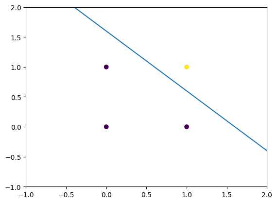

# Automatic Weights Updation [AND Gate]

This code implements the weights updation function using **Delta Rule**.
```
weights[j]=weights[j]+lrate*error*x[j]
```

We use a step function for activation, "np.dot()" for summation and a fit function with parameters like learing rate, epochsa and threshold.

### Graph:
